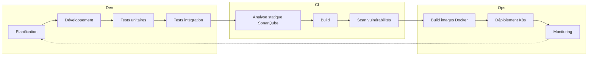

# Pipeline CI/CD et cycle DevSecOps

Cycle formalisé : **Planification → Développement → Tests → Analyse sécurité → Build → Déploiement → Monitoring**.

---

## 1. Schéma du pipeline

---

## 2. Outils et enchaînement

| Étape | Outil / mécanisme | Fichier / workflow |
|-------|--------------------|---------------------|
| Planification | Backlog (User Stories, critères d’acceptation) | `docs/backlog.md` |
| Développement | Git, branches main/develop | — |
| Tests unitaires | Jest | `.github/workflows/ci.yml` (jobs backend, fraud-service, notification-service) |
| Tests d’intégration | Jest E2E (API) | `.github/workflows/ci.yml` (job integration) |
| Analyse statique | SonarQube | `.github/workflows/ci.yml` (job sonar) |
| Scan vulnérabilités | Snyk, Trivy, OWASP ZAP | `.github/workflows/security.yml` |
| Build | npm / nest build, tsc | CI + build des images Docker dans deploy |
| Déploiement | Docker Registry (GHCR), Kubernetes | `.github/workflows/deploy.yml` |
| Monitoring | Prometheus, Grafana, Alertmanager | `docker-compose.yml`, `infra/k8s/` |

---

## 3. Workflows GitHub Actions

1. **CI** (`ci.yml`) : sur push/PR (main, develop)  
   Lint → Tests unitaires (avec couverture) → Build → (optionnel) Upload couverture → Job **integration** (E2E) → **SonarQube**.

2. **Security** (`security.yml`) : sur push main + planifié hebdo  
   **Snyk** (dépendances) → **ZAP** (DAST sur API) → **Trivy** (images Docker).

3. **Deploy** (`deploy.yml`) : sur push main ou tag v*  
   Build & push des images → Déploiement Kubernetes → Smoke test.

---

## 4. Lien avec les métriques qualité

- **Couverture** : fournie par les jobs de test (Jest) et consolidée dans SonarQube.
- **Complexité** : analysée par SonarQube (Quality Gate).
- **Taux d’échec pipeline** : suivi sur les runs des workflows CI / Security / Deploy.
- **Temps de déploiement** : durée du workflow Deploy (build + push + apply K8s).

Voir [Processus qualité](processus-qualite.md) pour les objectifs et seuils.
